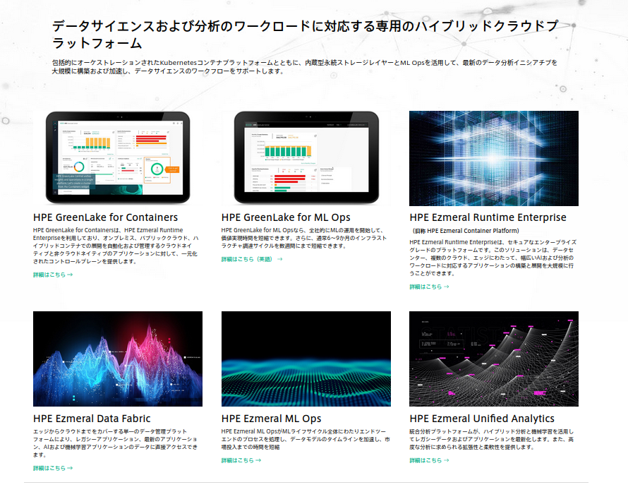

HPE Ezmeral と冠する商品がいくつかあり、また名称がだんだん変わっていっている。

[それらの違いを説明しているページはここ](https://www.hpe.com/jp/ja/software.html?jumpid=ps_qd51pshi67_aid-520061467&ef_id=CjwKCAjw1ICZBhAzEiwAFfvFhNM8gWISps00982EGufh6Iied3KqHlyvYtPjoQcfHCZiQCLK7ovRAxoCUAYQAvD_BwE:G:s&s_kwcid=AL!13472!3!571343007835!p!!g!!ezmeral!14402221620!123744403822&)

- どの商品が何をしてくれるのかわかりにくい
- ライセンシングがえげつない。<= 低入場料戦略なんでしょう

えげつないライセンシングから逃れるには、自分たちで k8s の開発にコミットするなどの体制が必要なのだろう。

## HPE GreenLake 

- HPE GreenLake for containers
- HPE GreenLake for ML Ops

## HPE Ezmeral Runtime Enterprise 

MapR を使わないと動かない商品

ハイブリッドクラウドにしたければこちらにしなければならない、という売り方らしい。

- HPE Ezmeral Runtime Enterprise
    - HPE Ezmeral Runtime Enterprise essentials <= mapR がなくても動く商品
    - HPE Ezmeral Runtime Enterprise
- HPE Ezmeral ML Ops
- HPE Ezmeral Data fabric
- HPE Ezmeral Unified Analytics

