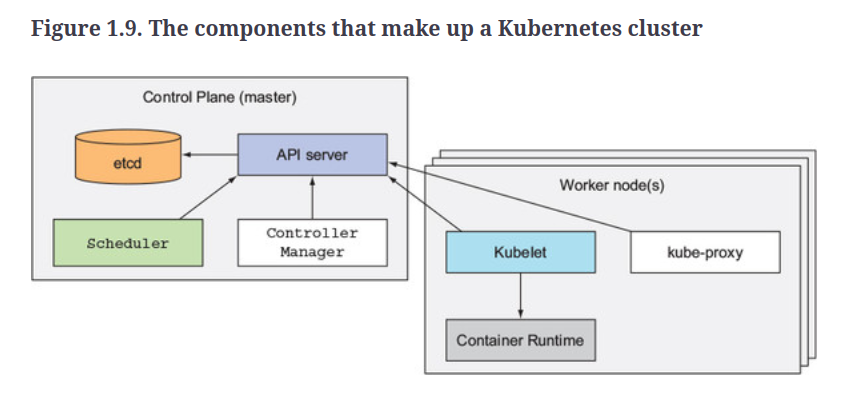

## 全体図


- 図を見ると、Node は Interntet => Firewall => Node 内の Proxy と通信できると書いてある。
- Master の方は kubectl コマンドが通信できると書いてある。

第 4 版では以下の図に変わっている。


この図は Kubernetes の公式ドキュメントの図と同じ。

- https://kubernetes.io/docs/concepts/overview/components/

---

上記の図はいずれにしろ見にくい。（字が小さい。要素が多すぎ。）

Kubernetes in Action (2018)の図のほうが見やすい。



この図は Kubernetes のコンポーネントとその配置を表している。

- クラスターは Master node と Worker node からなる。
- Master node では control plane に属するコンポーネントが動いている。
    - etcd : 管理用データベース
    - API server 
    - controller manager, scheduler 
- Worker node では以下のコンポーネントが動いている。
    - container runtime (Docker, rkt, ...)
    - kubelet : which talks to the API server and manages containers on its node
    - kube-proxy


## 用語の定義 : クラスター

- Clusters
    - A cluster is a collection of hosts (nodes).
        - つまり host = node と言っている。
- Nodes
    - A node is a single host. It may be a physical or virtual machine. 
        - つまり node = 物理計算機（または VM) = host と言っている。
    - Each Kubernetes node runs several Kubernetes components, such as the kubelet, the container runtime, and kube-proxy. 
        - （大抵の）node の上では kubelet, container runtime, kube-proxy が動いていて、
        （次の control plane の説明を読むと）とある node の上では control plane に属するソフトウェアが動いている、と解される。
- Control plane 
    - Usually, all the control plane components are set up on the same host although its not required.
        - こう書いてあるということは、Control plane は(node と対比されるようなものではなく)ソフトウェアである、と言っている。
    - The control plane of Kubernetes consists of several components:
        - an API server, 
        - a scheduler, 
        - a controller manager and optionally a cloud controller manager. 

第 3 版では The master is the control plane of Kubernetes.となっているが第 4 版では master という言葉が削除されている。
master と言ってしまうと master node つまり node の一種と解されてしまいがちだからだろう。そう取ってしまうと上記定義の辻褄が合わなくなってくる。


## クラスターの実例 : kind

kind は上記の物理計算機の意味の node の代わりに、Docker コンテナを node と見立てて Kubernetes を簡易的にデプロイする仕組み。

kind におけるノードとは？kind におけるマルチノード構成とは？

- kind は、一台の物理計算機の中でしか動作しない。複数台の物理計算機をつなぎ合わせて物理クラスタ構成とすることはできない。
- kind の用語でノードとは物理計算機に見立てた Docker コンテナのこと。
- kind の用語でマルチノード構成とは、１台の物理計算機の中に複数の Docker コンテナ(=kind の意味のノード）を立てて、Docker コンテナのクラスタを構成することを意味している。

## kind のインストール

Kubuntu Linux 22.04LTS に kind をインストールしてみた。

参考資料

- https://kind.sigs.k8s.io/docs/user/quick-start/


### kubectl のインストール

参考資料（kind の公式マニュアルのインストール手順）の冒頭に、kubectl をインストールせよと書いてあったので、
指示に従ってインストールした。

下記を参考にして kubectl をインストールせよとのこと。

- https://kubernetes.io/docs/tasks/tools/install-kubectl-linux/

手順の簡便さのため
パッケージマネージャを用いてインストールを行った。

Update the apt package index and install packages needed to use the Kubernetes apt repository:

    sudo apt-get update
    sudo apt-get install -y ca-certificates curl

Download the Google Cloud public signing key:

    sudo curl -fsSLo /etc/apt/keyrings/kubernetes-archive-keyring.gpg https://packages.cloud.google.com/apt/doc/apt-key.gpg

Add the Kubernetes apt repository:

    echo "deb [signed-by=/etc/apt/keyrings/kubernetes-archive-keyring.gpg] https://apt.kubernetes.io/ kubernetes-xenial main" | sudo tee /etc/apt/sources.list.d/kubernetes.list

Update apt package index with the new repository and install kubectl:

    sudo apt-get update
    sudo apt-get install -y kubectl


問題なくインストールされた。
最後の`sudo apt-get install -y kubectl`の結果は以下の通りであった。

```
oogasawa@MiniPC:~/tmp (2023-04-14 03:03:07)
$ sudo apt-get install -y kubectl
パッケージリストを読み込んでいます... 完了
依存関係ツリーを作成しています... 完了        
状態情報を読み取っています... 完了        
以下のパッケージが自動でインストールされましたが、もう必要とされていません:
  libflashrom1 libftdi1-2 libllvm13
これを削除するには 'sudo apt autoremove' を利用してください。
以下のパッケージが新たにインストールされます:
  kubectl
アップグレード: 0 個、新規インストール: 1 個、削除: 0 個、保留: 44 個。
10.2 MB のアーカイブを取得する必要があります。
この操作後に追加で 49.3 MB のディスク容量が消費されます。
取得:1 https://packages.cloud.google.com/apt kubernetes-xenial/main amd64 kubectl amd64 1.27.0-00 [10.2 MB]
10.2 MB を 2 秒 で取得しました (4,339 kB/s)
以前に未選択のパッケージ kubectl を選択しています。
(データベースを読み込んでいます ... 現在 249642 個のファイルとディレクトリがインストールされています。)
.../kubectl_1.27.0-00_amd64.deb を展開する準備をしています ...
kubectl (1.27.0-00) を展開しています...
kubectl (1.27.0-00) を設定しています ...
oogasawa@MiniPC:~/tmp (2023-04-14 03:03:28)
$ 

```


### kind のインストール

公式ドキュメントの"Quick Start" => "Install From Release Binaries"に従ってインストールした。

- https://kind.sigs.k8s.io/docs/user/quick-start/

手順は単に以下のとおりである。

On Linux:

```
cd $HOME/tmp
curl -Lo ./kind https://kind.sigs.k8s.io/dl/v0.18.0/kind-linux-amd64
chmod +x ./kind
sudo mv ./kind /usr/local/bin/kind
```

問題なくインストールされた。実行結果は以下のとおりであった。

```
ogasawa@MiniPC:~/tmp (2023-04-14 03:08:37)
$ curl -Lo ./kind https://kind.sigs.k8s.io/dl/v0.18.0/kind-linux-amd64
  % Total    % Received % Xferd  Average Speed   Time    Time     Time  Current
                                 Dload  Upload   Total   Spent    Left  Speed
100    97  100    97    0     0    208      0 --:--:-- --:--:-- --:--:--   208
  0     0    0     0    0     0      0      0 --:--:-- --:--:-- --:--:--     0
100 6808k  100 6808k    0     0  3032k      0  0:00:02  0:00:02 --:--:-- 7684k
oogasawa@MiniPC:~/tmp (2023-04-14 03:08:47)
$ chmod +x ./kind
oogasawa@MiniPC:~/tmp (2023-04-14 03:08:56)
$ sudo mv ./kind /usr/local/bin/kind
oogasawa@MiniPC:~/tmp (2023-04-14 03:09:06)
$ 

```


### Creating a Cluster

`kind create cluster`を実行するだけでクラスターが作られるとのことなのでやってみた。

- Docker を一般ユーザで実行できるように設定していなかったので、`sudo`が必要だった。

```
oogasawa@MiniPC:~/tmp (2023-04-14 03:09:06)
$ kind create cluster
ERROR: failed to create cluster: failed to list nodes: command "docker ps -a --filter label=io.x-k8s.kind.cluster=kind --format '{{.Names}}'" failed with error: exit status 1
Command Output: Got permission denied while trying to connect to the Docker daemon socket at unix:///var/run/docker.sock: Get "http://%2Fvar%2Frun%2Fdocker.sock/v1.24/containers/json?all=1&filters=%7B%22label%22%3A%7B%22io.x-k8s.kind.cluster%3Dkind%22%3Atrue%7D%7D": dial unix /var/run/docker.sock: connect: permission denied
oogasawa@MiniPC:~/tmp (2023-04-14 03:14:21)
$ sudo kind create cluster
Creating cluster "kind" ...
 ✓ Ensuring node image (kindest/node:v1.26.3) 🖼 
 ✓ Preparing nodes 📦  
 ✓ Writing configuration 📜 
 ✓ Starting control-plane 🕹️ 
 ✓ Installing CNI 🔌 
 ✓ Installing StorageClass 💾 
Set kubectl context to "kind-kind"
You can now use your cluster with:

kubectl cluster-info --context kind-kind

Not sure what to do next? 😅  Check out https://kind.sigs.k8s.io/docs/user/quick-start/
```

この状態だと、同様に、`kubectl`をつかうときにも`sudo`が必要であった。

```
oogasawa@MiniPC:~/tmp (2023-04-14 03:16:12)
$ kubectl cluster-info --context kind-kind
error: context "kind-kind" does not exist

oogasawa@MiniPC:~/tmp (2023-04-14 03:20:37)
$ sudo kubectl cluster-info --context kind-kind
Kubernetes control plane is running at https://127.0.0.1:44393
CoreDNS is running at https://127.0.0.1:44393/api/v1/namespaces/kube-system/services/kube-dns:dns/proxy

To further debug and diagnose cluster problems, use 'kubectl cluster-info dump'.
oogasawa@MiniPC:~/tmp (2023-04-14 03:20:59)
$
```

この例のように単に`kind create cluster`コマンドを実行すると、kind-control-plane という node 1 つからなるクラスタが生成された。

```
oogasawa@MiniPC:~/tmp (2023-04-14 03:42:42)
$ sudo kubectl get nodes
NAME                 STATUS   ROLES           AGE   VERSION
kind-control-plane   Ready    control-plane   26m   v1.26.3
oogasawa@MiniPC:~/tmp (2023-04-14 03:42:49)
$ 

```

### Deleting a Cluster

この例のように単に`kind create cluster`コマンドでクラスタを作った場合は、
単に`kind delete cluster`を実行することでクラスタが削除できた。

```
oogasawa@MiniPC:~/tmp (2023-04-14 03:42:49)
$ sudo kind delete cluster
Deleting cluster "kind" ...
Deleted nodes: ["kind-control-plane"]
oogasawa@MiniPC:~/tmp (2023-04-14 03:48:14)
$ sudo kubectl cluster-info 
E0414 03:48:26.486964  157208 memcache.go:265] couldn't get current server API group list: Get "http://localhost:8080/api?timeout=32s": dial tcp 127.0.0.1:8080: connect: connection refused
E0414 03:48:26.487394  157208 memcache.go:265] couldn't get current server API group list: Get "http://localhost:8080/api?timeout=32s": dial tcp 127.0.0.1:8080: connect: connection refused
E0414 03:48:26.489075  157208 memcache.go:265] couldn't get current server API group list: Get "http://localhost:8080/api?timeout=32s": dial tcp 127.0.0.1:8080: connect: connection refused
E0414 03:48:26.490790  157208 memcache.go:265] couldn't get current server API group list: Get "http://localhost:8080/api?timeout=32s": dial tcp 127.0.0.1:8080: connect: connection refused
E0414 03:48:26.491691  157208 memcache.go:265] couldn't get current server API group list: Get "http://localhost:8080/api?timeout=32s": dial tcp 127.0.0.1:8080: connect: connection refused

To further debug and diagnose cluster problems, use 'kubectl cluster-info dump'.
The connection to the server localhost:8080 was refused - did you specify the right host or port?
oogasawa@MiniPC:~/tmp (2023-04-14 03:48:26)
$ 
```


### スワップについて

公式ドキュメントのインストール方法である kubeadm を使って Kubernetes をインストールするときにはスワップがオフになっているかインストール時にチェックされる。

- https://kubernetes.io/docs/setup/production-environment/tools/kubeadm/create-cluster-kubeadm/


しかし kind のインストール作業では、以下のようにスワップ自体は存在していたにもかかわらず何も言われなかった。

```
oogasawa@MiniPC:~/public_html/works/fasta_store (2023-04-14 09:54:37)
$ swapon -s
Filename        Type		Size		Used		Priority
/swapfile       file		2097148		0		-2
```

以下は ChatGPT の出力

Kubernetes in Docker (kind)は、ローカル環境で Kubernetes を実行するためのツールであり、スワップがオンになっていても機能しますが、推奨されていません。スワップは、パフォーマンスに悪影響を与える可能性があります。

スワップが有効になっている場合、メモリが不足した場合に、一部のデータがディスクにスワップアウトされます。これにより、パフォーマンスが低下し、アプリケーションのレイテンシーやスループットが低下する可能性があります。

Kubernetes では、ノードのメモリを管理する kubelet がスワップをオフにすることが推奨されています。したがって、kind を使用する場合でも、スワップをオフにすることを推奨します。スワップをオフにするには、次のように設定ファイルを変更することができます。

```
$ sudo swapoff -a
```

ただし、スワップをオフにする前に、十分なメモリを持つかどうかを確認することが重要です。十分なメモリがない場合、アプリケーションがクラッシュする可能性があります。

