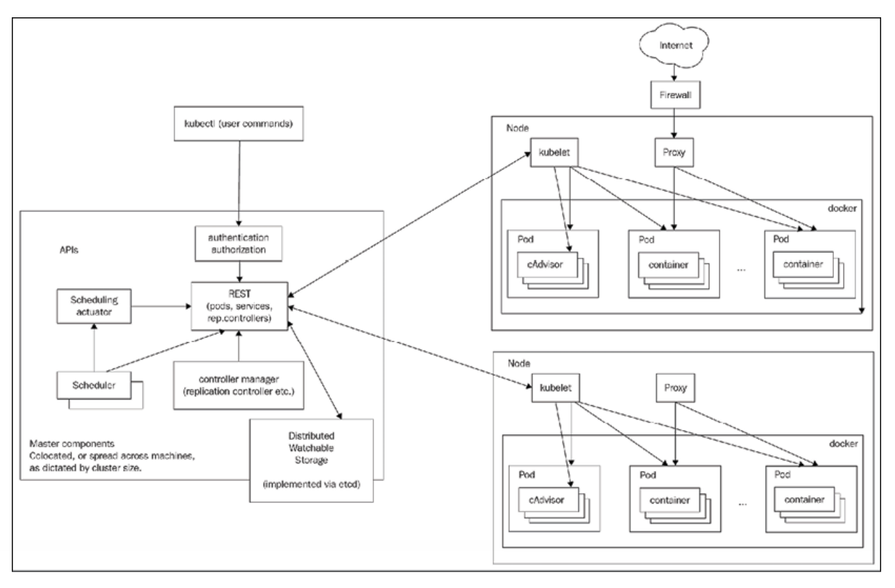
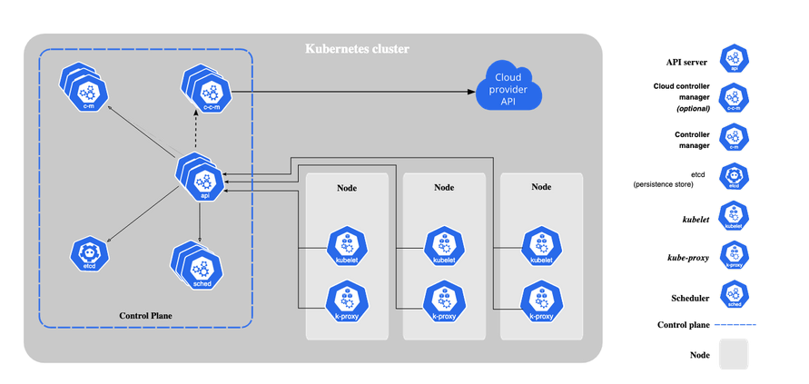

## 全体図

- 図を見ると、Node は Interntet => Firewall => Node 内の Proxy と通信できると書いてある。
- Master の方は kubectl コマンドが通信できると書いてある。

第 4 版では以下の図に変わっている。

## 用語の定義 : クラスター

- Clusters
    - A cluster is a collection of hosts (nodes).
        - つまり host = node と言っている。
- Nodes
    - A node is a single host. It may be a physical or virtual machine. 
        - つまり node = 物理計算機（または VM) = host と言っている。
    - Each Kubernetes node runs several Kubernetes components, such as the kubelet, the container runtime, and kube-proxy. 
        - （大抵の）node の上では kubelet, container runtime, kube-proxy が動いていて、
        （次の control plane の説明を読むと）とある node の上では control plane に属するソフトウェアが動いている、と解される。
- Control plane 
    - Usually, all the control plane components are set up on the same host although its not required.
        - こう書いてあるということは、Control plane は(node と対比されるようなものではなく)ソフトウェアである、と言っている。
    - The control plane of Kubernetes consists of several components:
        - an API server, 
        - a scheduler, 
        - a controller manager and optionally a cloud controller manager. 

第 3 版では The master is the control plane of Kubernetes.となっているが第 4 版では master という言葉が削除されている。
master と言ってしまうと master node つまり node の一種と解されてしまいがちだからだろう。そう取ってしまうと上記定義の辻褄が合わなくなってくる。

