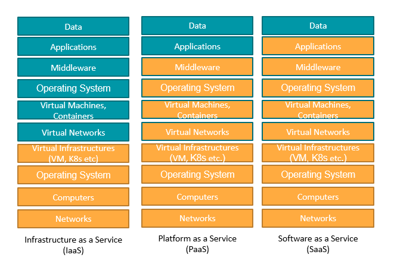
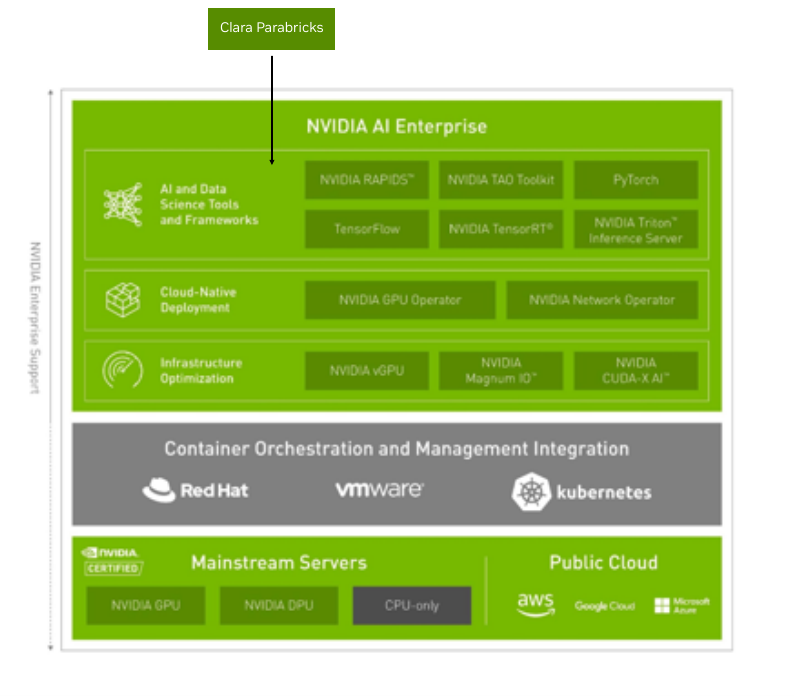

## 1. Web アプリケーション、データベースの公開

DDBJ が公開している多数の Web アプリケーション、データベースを公開したい。
（開発効率向上のため仮想基盤を使いたい。）

- 計算ノードが壊れたときに自動的に別のノード上でサービスを継続できるようにしたい。
- autoscale までは今の所考えていない。

### 開発と計算基盤管理の分離

古の UNIX 管理手法では、ミドルウェアのインストールにルート権限が必要であることから、
ミドルウェアの管理までが計算基盤側の仕事であったが、今日ではこのモデルは破綻している。

仮想基盤技術の登場により、開発者側で仮想ネットワークからアプリケーションまでを管理できるようになった。
今日の開発プロセスではこうなっていないと効率が悪い。

（小言）
- クラスタ計算機を構成するノードが時々壊れるのは当たり前。
    - 壊れてもサービスが止まらないようにするのはソフトウェア側の責任
    - k8s が無くても他にも色んな方法がある。k8s がいつも最適なわけでもない。
- ついでにいうと、スパコンはそのへんのソフトを置いておくと自動的によしなに速くしてくれる機械ではない。
    - 上手に使えば速くなるもの。

## 2. ビッグデータ系のミドルウェアの利用（バッチ処理）

- Spark などでデータ処理をしたくなったときに、簡単に使えるようにしたい。
    - これについては、必ずしも k8s を使わないといけないわけではない。すべての管理を k8s にしたいわけではない。
        - VxLAN などの仮想ネットワークを使うと、それなりに性能の劣化があるので本来は避けるべきかもしれない。
    - k8s を使えば物理計算機の節約になることが期待される。

- nVIDIA の AI 解析基盤を、簡単に使えるようにしたい。

## 3. スパコンの稼働統計の取得

- スパコン全体のログ解析（ログの保管を含めて）を k8s の上で行いたい。
    - ログの保管を管理ネットワーク上で行っているが、安全な区画を物理計算基盤で構築しようとすると 
    (1)まず、いちいちハードウェアを購入しなければならずお金と時間がかかる。 (2)本当に設定が安全であるかどうか判然としない。
    - **むしろ k8s 仮想基盤上にセキュリティー上重要なものを置いてしまったほうが安全なのではないか？**
        - => Sysdig の導入（検証）

(小言)
- 遺伝研スパコン上の問題を実データで表現し理解していないのであれば、明日から外の人が遺伝研スパコンを運用してもなんの問題もないことになる。知っていることが全く一緒だから。
- 遺伝研スパコンは逼迫している => 稼働統計は予算要求のために最重要。稼働統計は売上に直結している。
    - ユーザ対応がもう一つの鍵。
